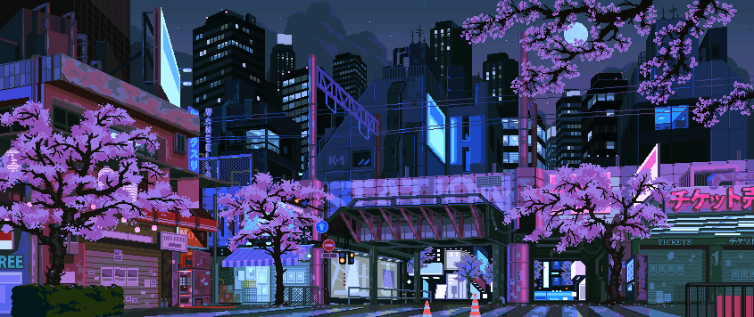
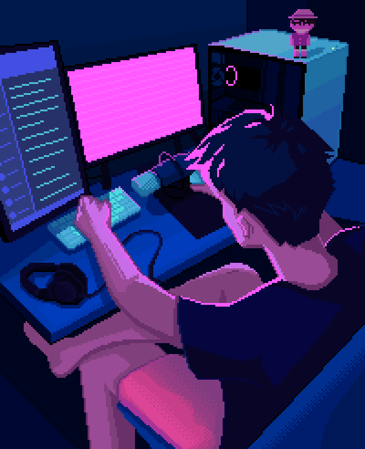

 

  

<h3 align="center">Student • Learning Full Stack Development (MERN)</h3>

  

  
  
  

<h2 align="center"><em>About Me</em></h2>
<table>
<tr>
<td width="65%">

Hi, I'm <b>Roshan</b> — a student learning by actually building things.
Currently deep into the MERN stack, crafting Firefox extensions with
vanilla JS, poking at backend APIs, and customizing Linux workflows.
Not an expert yet, but getting there every day.

 

  <em><b>Building with MERN</b></em> &nbsp;•&nbsp;
  <em><b>Shipping Firefox Extensions</b></em> &nbsp;•&nbsp;
  <em><b>Tinkering with Linux</b></em>

</td>
<td width="35%" align="center">
  
</td>
</tr>
</table>

<h2 align="center"><em>Tech Stack</em></h2>

<b>Frontend</b>

  
  
  
  
  

<b>Backend</b>

  
  

<b>Database</b>

  
  

---

<h2 align="center"><em>Projects</em></h2>

<table align="center" width="100%">
<tr>

<!-- ROX Gateway -->
<td width="50%" valign="top" align="center">
 
<h3> ROX Gateway</h3>

A fast, minimal web portal to access curated platforms across movies, anime, manga, live TV, and apps — all in one place.

  
  
  
  

  ✦ Real-time search filtering 
  ✦ Category-based navigation 
  ✦ Clean responsive UI 
  ✦ Lightweight & fast

  
  &nbsp;
  

 
</td>

<!-- Conky Setup -->
<td width="50%" valign="top" align="center">
 
<h3> Minimal Conky Setup</h3>

A modern, lightweight Conky config for clean Linux desktops — minimal system monitoring with a polished transparent UI and Nord-inspired palette.

  
  
  

  ✦ Real-time CPU & memory stats 
  ✦ Floating todo widget 
  ✦ Transparent minimal design 
  ✦ Works on GNOME, KDE & more

  

 
</td>

</tr>
<tr>

<!-- Firefox Extensions -->
<td colspan="2" valign="top" align="center">
 
<h3> Firefox Extensions</h3>

A growing collection of Firefox extensions — vanilla JS, no bundlers, no telemetry, browser-native APIs only.

  
  
  
  

<table align="center" width="80%">
<tr>
<td align="center" width="50%">
<b> SleepingTab</b> 
Lightweight tab sleep & activity manager  

&nbsp;

</td>
<td align="center" width="50%">
<b> YouTube Focus Mode</b> 
Hide Shorts, recommendations, comments & feed  

&nbsp;

</td>
</tr>
</table>

  

 
</td>

</tr>
<tr>

<!-- Coming Soon -->
<td colspan="2" align="center">
 
<h3> More Coming Soon</h3>

Currently cooking up new projects — stay tuned!

  

 
</td>

</tr>
</table>

---

<h2 align="center"><em>Statistics</em></h2>

  
    
  
    

---

  

